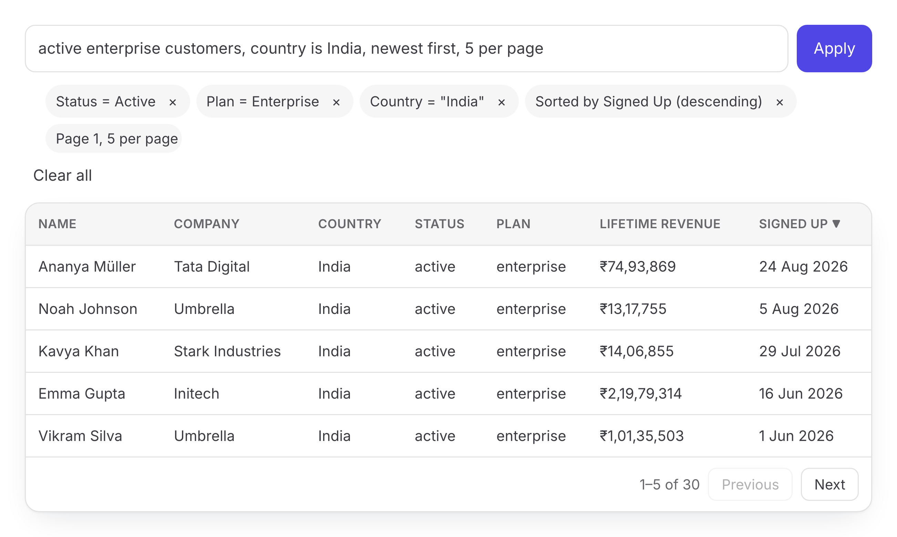

# Pragma

**Natural-language queries for data tables — as a validated, library-agnostic `TableQuery`.**

**[Website & docs](https://avinash-baraiya.github.io/Pragma/)** · **[Live playground](https://avinash-baraiya.github.io/Pragma/guide/playground)** · **[Getting started](https://avinash-baraiya.github.io/Pragma/guide/getting-started)**



Give Pragma a typed table schema and a user's instruction ("active enterprise customers in India, newest first, 50 per page"). It returns a standard query payload (search, filters, sort and pagination) that any table library, API or database adapter can execute.

```text
schema + instruction (+ current state)
        │
        ▼
 deterministic parser ──(not fully understood)──▶ language model (server-side)
        │                                                  │
        └──────────────────────┬───────────────────────────┘
                               ▼
        validate · apply · normalize · analyze · explain
                               ▼
                    TableQuery  ─▶  TanStack · your API · SQL builder · ...
```

Natural language is an input modality, not the source of truth. **The model proposes; the engine decides.** Every field, operator and value a model proposes is validated against the schema before anything is applied. Hidden fields cannot be reached, and ambiguity is surfaced instead of guessed.

## Why

- **One protocol, many tables.** The `TableQuery` payload knows nothing about React, TanStack, SQL or any model vendor. Adapters translate it.
- **Correct before clever.** A deterministic parser handles explicit instructions with no model call. It claims an instruction only when it understands _every_ word; everything else goes to a model, and the model's output is validated like untrusted input.
- **Safe by construction.** Hidden fields are indistinguishable from non-existent ones. Model output can never widen the schema, and row data is never sent to a model.
- **Transparent.** Every result carries a deterministic explanation, removable chips, warnings (e.g. "these conditions can never match") and clarification questions when the request is ambiguous.

## Packages

| Package                                                       | What it does                                                                                                                                                                |
| ------------------------------------------------------------- | --------------------------------------------------------------------------------------------------------------------------------------------------------------------------- |
| [`@avinash-baraiya/pragma`](packages/pragma)                  | **Start here.** Everything below in one install, imported by subpath: `/react`, `/tanstack`, `/tanstack/react`, `/server`, `/providers/<name>`, `/styles.css`.              |
| [`@avinash-baraiya/pragma-core`](packages/core)               | Schema model, `TableQuery` protocol, operators, validator, normalizer, date semantics, explanations, reference executor, `@`-mentions. No framework or vendor dependencies. |
| [`@avinash-baraiya/pragma-interpreter`](packages/interpreter) | `createEngine`: deterministic parser, model routing, clarification flow, cache, and the model-agnostic LLM layer (`LanguageModelProvider`).                                 |
| [`@avinash-baraiya/pragma-providers`](packages/providers)     | Model integrations: OpenAI-compatible (OpenAI, OpenRouter, Groq, Ollama, vLLM, …), Anthropic, Gemini, Vercel AI SDK, mock, and the browser `remoteInterpreter`.             |
| [`@avinash-baraiya/pragma-server`](packages/server)           | Web-standard HTTP handler (Next.js, Hono, Bun, Deno, Workers) plus a Node/Express adapter. Keeps model credentials server-side.                                             |
| [`@avinash-baraiya/pragma-react`](packages/react)             | Accessible `AskBar` with local `@` autocomplete, `QueryChips`, `Explanation`, `ClarificationPrompt`, `Feedback`.                                                            |
| [`@avinash-baraiya/pragma-tanstack`](packages/tanstack)       | TanStack Table adapter (v9), verified row-for-row against the reference executor, plus the `usePragmaTable` hook.                                                           |

## Quick start

```bash
npm install @avinash-baraiya/pragma @tanstack/react-table
```

One package, with subpath imports for each part. Only what you import reaches your bundle.

**Server** (holds the model key):

```ts
import { createPragmaHandler } from '@avinash-baraiya/pragma/server';
import { openAICompatible } from '@avinash-baraiya/pragma/providers/openai-compatible';
import { customersSchema } from './schema';

export const POST = createPragmaHandler({
  schemas: { customers: customersSchema },
  provider: openAICompatible({
    baseURL: 'https://api.openai.com/v1',
    model: process.env.MODEL!,
    apiKey: process.env.OPENAI_API_KEY,
  }),
  authorize: ({ request }) => isSignedIn(request),
});
```

**Browser:**

```tsx
import { createEngine } from '@avinash-baraiya/pragma';
import { remoteInterpreter } from '@avinash-baraiya/pragma/providers/remote';
import {
  AskBar,
  ClarificationPrompt,
  Feedback,
  PragmaProvider,
  QueryChips,
  usePragma,
} from '@avinash-baraiya/pragma/react';
import { usePragmaTable } from '@avinash-baraiya/pragma/tanstack/react';
import '@avinash-baraiya/pragma/styles.css';

const engine = createEngine({
  schema: customersSchema,
  timezone: Intl.DateTimeFormat().resolvedOptions().timeZone,
  interpreter: remoteInterpreter({ url: '/api/pragma' }),
});

function Customers({ rows }) {
  const { query, setQuery } = usePragma();
  const { table } = usePragmaTable({
    schema: customersSchema,
    query,
    onQueryChange: setQuery,
    data: rows,
    columns,
  });
  return <DataTable table={table} />;
}

<PragmaProvider engine={engine}>
  <AskBar />
  <ClarificationPrompt />
  <Feedback />
  <QueryChips />
  <Customers rows={rows} />
</PragmaProvider>;
```

Or send `query` to your backend and execute it there. See [integration](docs/integration.md).

Run the full example (offline mock model, no key needed):

```bash
pnpm install
pnpm --filter tanstack-react-example dev
```

## Documentation

| Topic                                |                                                                        |
| ------------------------------------ | ---------------------------------------------------------------------- |
| [Architecture](docs/architecture.md) | Pipeline, package boundaries, key decisions                            |
| [Protocol](docs/protocol.md)         | `TableQuery`, mutations, results, versioning of the payload            |
| [Schema](docs/schema.md)             | Fields, types, aliases, enums, capabilities, hidden fields             |
| [Operators](docs/operators.md)       | Every operator and its exact semantics (text, nulls, dates, timezones) |
| [Errors](docs/errors.md)             | Stable error and warning codes, HTTP mapping                           |
| [Ambiguity](docs/ambiguity.md)       | When Pragma asks, what it never guesses, `bestGuess` policy            |
| [Security](docs/security.md)         | Threat model and guarantees                                            |
| [Integration](docs/integration.md)   | Client mode, server mode, adapters, custom tables                      |
| [Models](docs/llm.md)                | Providers, custom providers, prompts, retries, fallback, cost          |
| [Testing](docs/testing.md)           | Test strategy, conformance suite, fuzzing, evaluation                  |
| [Versioning](docs/versioning.md)     | Semver policy, protocol evolution, deprecations                        |
| [Decisions](docs/adr)                | Architecture decision records                                          |

## Development

Requires Node ≥ 22.12 and pnpm 10.

```bash
pnpm install
pnpm test            # all unit, conformance, fuzz and dataset-gate tests
pnpm test:coverage   # with enforced thresholds
pnpm lint && pnpm typecheck && pnpm format:check
pnpm build && pnpm check:packages && pnpm size
pnpm eval            # evaluation report (add --provider=... for a model)
```

The website lives in [`website/`](website) (VitePress):

```bash
pnpm --filter @avinash-baraiya/pragma-website dev           # local preview
pnpm --filter @avinash-baraiya/pragma-website screenshots   # refresh screenshots (Playwright)
```

It deploys to GitHub Pages from `main` via `.github/workflows/docs.yml`.

See [CONTRIBUTING.md](CONTRIBUTING.md) and [SECURITY.md](SECURITY.md).
